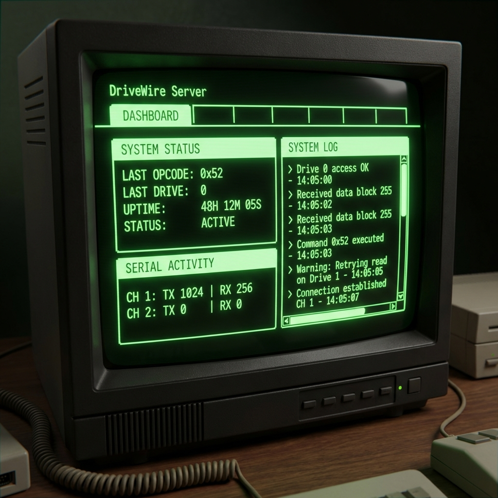

#  DriveWire 

DriveWire defines a standard for guest computers to access input/output resources on a host computer. This model gives the guest computer the appearance that it is directly connected to a large storage device, when in fact, connectivity is achieved using a serial cable connected to the host.

There are distinct advantages in utilizing DriveWire as a storage medium:

- **Cost and space savings:** No additional hardware is needed for a guest to use mass storage; no floppy controller, hard drive controller or hard drives are required.
- **Remote operation:** The serial cable that tethers the guest to the host can extend for some length, allowing the guest to be positioned a considerable distance.
- **Easy data management:** Virtual disks that reside on the host can be easily copied, emailed or archived for backup purposes.

The essence of communication between the guest and host is a documented set of uni- and bi-directional messages called *transactions*. Each transaction is composed of one or more packets, which are passed between the guest and host through a serial line connection.

[The DriveWire Specification](https://github.com/boisy/DriveWire/wiki/DriveWire-Specification) provides the information needed to implement both a host and a guest.

## Host platforms

This repository has DriveWire host implementations for supported platforms:

- UNIX: [C](c)
- Mac: [Swift](swift) and [Objective-C](objc)
- Windows: [Delphi](delphi)
- MicroPython: [MicroPython](micropython) (for RPi Pico W / Pico 2 W)

There are other repositories that host DriveWire implementations:

- Python: Mike Furman hosts [pyDriveWire](https://github.com/n6il/pyDriveWire).
- Java: Aaron Wolfe's [DriveWire 4 Server](https://github.com/qbancoffee/drivewire4) updated by Rocky Hill.

## MicroPython Implementation

The [MicroPython](micropython) folder contains a complete DriveWire 4 server designed to run on low-cost microcontrollers like the **Raspberry Pi Pico W** and **Pico 2 W**. 

### Web Interface

### Key Features:
- **Web-Based Management**: A retro-themed (Tandy/CoCo aesthetic) dark mode web interface.
- **SD Card Support**: External SD card storage via SPI with FAT/FAT32 support — disk images from internal flash and SD card appear seamlessly in the same UI with storage-type badges.
- **Activity LED**: Onboard LED blinks during disk reads/writes and stays lit during flush, providing a visual HDD-style activity indicator.
- **Robust Error Handling**: Comprehensive exception handling across all I/O operations with graceful fallbacks, input validation, and resource cleanup.
- **Virtual Serial TCP/IP**: Map CoCo virtual serial ports to external network services (Support for both Client and Server modes).
- **Serial Terminal Tab**: Real-time diagnostic monitor for snooping on any virtual serial channel.
- **Status Dashboard**: Live monitoring of DriveWire opcodes, drive access, serial port activity, and SD card status.
- **Disk Management**: Automatic scanning of local/SD card storage for `.dsk` files with a dropdown selection UI.
- **Time Sync**: Built-in NTP synchronization support for the CoCo.

For setup instructions and detailed information, see the [MicroPython README](micropython/README.md).

## History

DriveWire began life in 2003 as a solution for the Tandy Color Computer. Floppy drives were starting to wane and modern storage options for older computer systems were still years from being developed. [Boisy Pitre](http://www.pitre.org/) gave [this talk](https://www.youtube.com/watch?v=-w7X0CfqFbc) on DriveWire's history and development at Tandy Assembly on October 2, 2021.

In January 2010, Aaron Wolfe, Boisy Pitre, and Jim Hathaway expanded the protocol to include networking services. [This work](https://web.archive.org/web/20100121100655/http://home.spogbiper.com/) became the 1st place winner in the [2010 RetroChallenge Winter Warmup](https://web.archive.org/web/20100110223653/http://www.retrochallenge.net/updates.html). Aaron went on to create DriveWire 4, a Java-based host.

DriveWire is still in use today, and there are a number of [YouTube videos](https://www.youtube.com/results?search_query=drivewire+coco) showing it in action.
