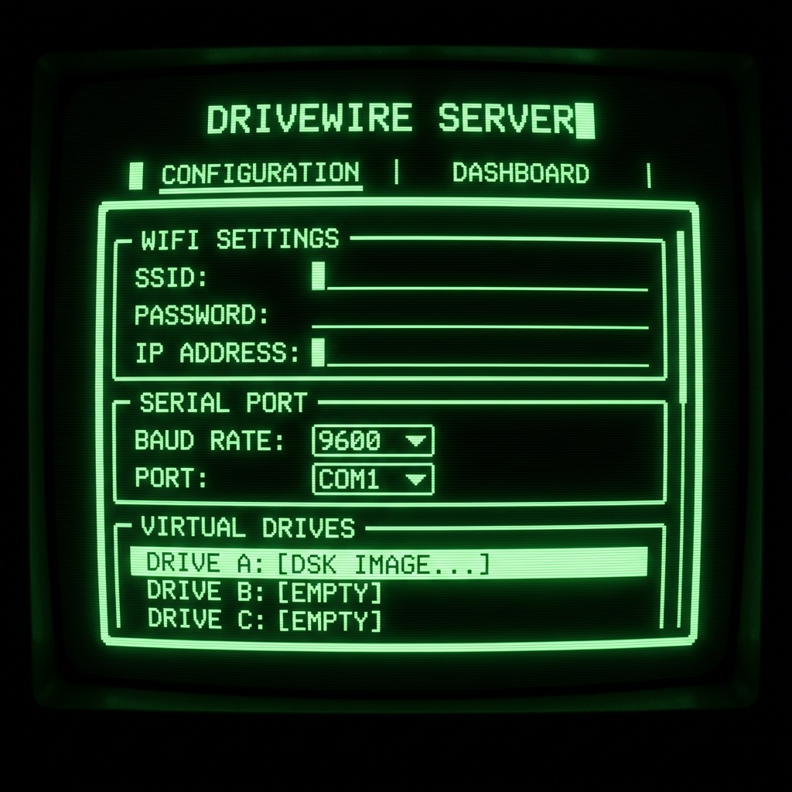

# MicroPython DriveWire Server

A full-featured DriveWire 4 server implementation in MicroPython, optimized for the **Raspberry Pi Pico W** and **Pico 2 W** with advanced memory management and performance optimizations.

## Screenshots


*Live Dashboard showing real-time DriveWire activity and system logs.*


*Retro-styled configuration interface (Tandy/CoCo aesthetic).*

## Key Features

- **Flash Wear Protection**: Sector-level write-back cache buffers all disk writes in RAM and syncs to flash only once per minute of inactivity, significantly extending flash lifespan
- **Memory Optimized**: Reduced cache sizes and const() declarations minimize RAM usage (~80-120KB typical)
- **Retro Web Dashboard**: Tandy/CoCo-inspired dark mode web interface for configuration and monitoring
- **Virtual Serial TCP/IP**: Map CoCo virtual serial ports to external network services (client and server modes)
- **Serial Terminal Tab**: Real-time diagnostic monitor for any virtual serial channel
- **Disk Management**: Dropdown selection for `.dsk` files from local storage and SD cards
- **Automatic Library Installation**: Built-in installer fetches dependencies (`microdot`) from GitHub with retry logic
- **NTP Time Sync**: Automatic CoCo system time synchronization with retry support

## Hardware Requirements

- **Microcontroller**: Raspberry Pi Pico W or Pico 2 W
- **Serial Connection**: UART pins (TX: GP0, RX: GP1 by default)
- **Level Shifter**: TTL-to-RS232 level shifter **required** to safely connect to the CoCo's serial port
- **Memory**: Minimum 264KB RAM (Pico W/2 W have sufficient memory)

## Performance & Memory

**Memory Usage:**
- Base system: ~60-80KB
- Per mounted drive: ~2-4KB (with 8-entry cache)
- Web server: ~20-30KB
- Total typical usage: 80-120KB

**Optimizations:**
- Reduced read cache from 16 to 8 entries per drive (saves ~2KB per drive)
- `micropython.const()` for all opcodes and constants (saves RAM)
- Limited channel buffers to 256 bytes max
- Efficient timeout handling with reset on successful reads

## Quick Start

1. **Upload Files**: Copy all files from the `micropython` folder to your Pico W/2 W root directory
2. **Configure WiFi**: Edit `config.json` on the device:
   ```json
   {
     "wifi_ssid": "YourNetworkName",
     "wifi_password": "YourPassword",
     "baud_rate": 115200
   }
   ```
3. **Power On**: Device will auto-connect to WiFi and install `microdot` if missing (requires internet)
4. **Access Dashboard**: Open browser to the IP address shown in serial terminal (use Thonny or similar)
5. **Connect CoCo**: Attach serial cable and start DriveWire on your CoCo (e.g., `DRIVEWIRE` in Disk BASIC 2.0)

## File Structure

- `main.py`: Entry point; starts the servers.
- `drivewire.py`: Core DriveWire protocol logic.
- `web_server.py`: Microdot-based web server and API.
- `config.py`: Configuration management.
- `lib_installer.py`: Automated dependency installer.
- `www/`: Static assets for the web dashboard.

## Dashboard Usage

Access the web UI to monitor live activity:
- **Last OpCode**: Most recent command from the CoCo
- **Serial Activity**: TX/RX byte counts for active virtual serial channels
- **System Logs**: Live scroll of internal events (last 20 entries)
- **Drive Stats**: Read/write statistics and cache hit rates
- **Memory Status**: Free memory reported at boot and startup

## Troubleshooting

### WiFi Connection Issues
- **Problem**: "WiFi connection failed after all retries"
- **Solution**: Verify SSID and password in `config.json`. Check that your network is 2.4GHz (Pico W doesn't support 5GHz)

### Library Installation Fails
- **Problem**: "Manual download failed" or "All download attempts failed"
- **Solution**: Manually download `microdot.py` and `microdot_asyncio.py` from [microdot v1.3.4](https://github.com/miguelgrinberg/microdot/tree/v1.3.4/src) and copy to device root

### CoCo Not Responding
- **Problem**: CoCo hangs or doesn't detect DriveWire
- **Solution**: 
  - Verify level shifter connections (TX/RX not swapped)
  - Check baud rate matches CoCo settings (default 115200)
  - Ensure UART0 (GP0/GP1) is not used by REPL
  - Try power cycling both devices

### Memory Errors
- **Problem**: "MemoryError" or system crashes
- **Solution**: 
  - Reduce number of mounted drives
  - Clear `error.log` and `boot_error.log` files
  - Run `gc.collect()` in REPL before starting
  - Check free memory with `import gc; gc.mem_free()`

### Time Sync Fails
- **Problem**: "Time sync failed after all retries"
- **Solution**: Verify NTP server is reachable. Try changing `ntp_server` in config to `"time.google.com"` or `"time.nist.gov"`

## Advanced Configuration

### Virtual Serial Mapping
Map CoCo serial channels to TCP connections in `config.json`:
```json
"serial_map": {
  "0": {"host": "towel.blinkenlights.nl", "port": 23, "mode": "client"}
}
```

### Timezone Configuration
Set timezone offset from UTC (-12 to +14):
```json
"timezone_offset": -6
```

### Custom Baud Rates
Supported rates: 9600, 19200, 38400, 57600, 115200, 230400, 460800, 921600

## Contributing

This is a fork of the original [DriveWire](https://github.com/boisy/DriveWire) project. Contributions welcome!
