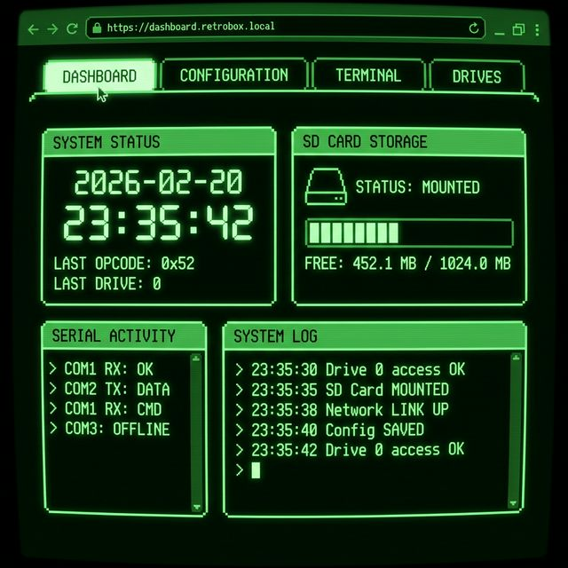
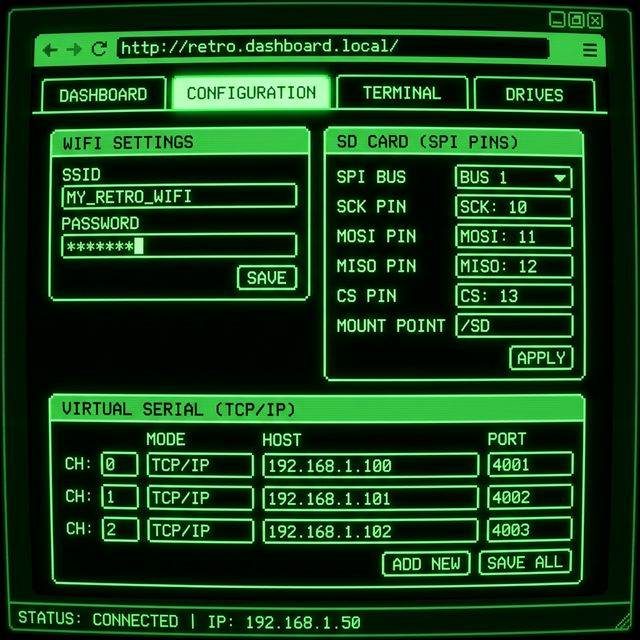
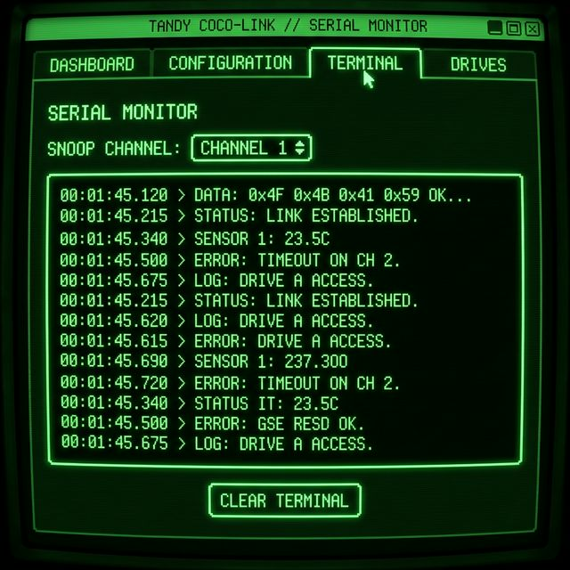
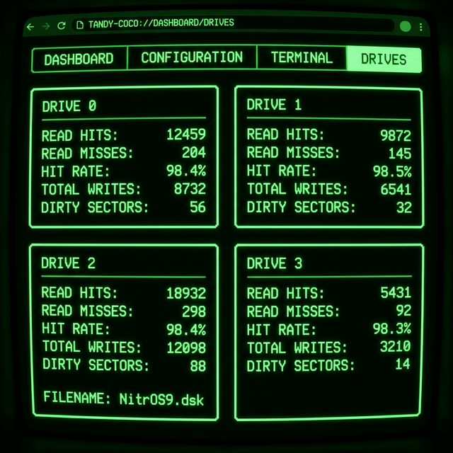

# MicroPython DriveWire Server

A full-featured DriveWire 4 server implementation in MicroPython, optimized for the **Raspberry Pi Pico W** and **Pico 2 W** with advanced memory management and performance optimizations.

## Web Interface


*Live Dashboard showing real-time DriveWire activity and system logs.*

The DriveWire server features a modern, responsive web dashboard with a retro Tandy/CoCo phosphor aesthetic. See the [Web Interface](#web-interface-dashboard) section for more details.

## Key Features

- **Flash Wear Protection**: Sector-level write-back cache buffers all disk writes in RAM and syncs to flash only once per minute of inactivity, significantly extending flash lifespan
- **SD Card Support**: External SD card storage via SPI with automatic FAT/FAT32 mounting — disk images from internal flash and SD appear seamlessly in the same UI
- **Activity LED**: Onboard LED blinks during disk read/write operations and stays lit during flush — a visual indicator of DriveWire activity
- **Robust Error Handling**: Comprehensive exception handling across all I/O operations with graceful fallbacks, input validation, and resource cleanup
- **Memory Optimized**: Reduced cache sizes and const() declarations minimize RAM usage (~80-120KB typical)
- **Retro Web Dashboard**: Tandy/CoCo-inspired dark mode web interface for configuration and monitoring
- **Virtual Serial TCP/IP**: Map CoCo virtual serial ports to external network services (client and server modes)
- **Serial Terminal Tab**: Real-time diagnostic monitor for any virtual serial channel
- **Disk Management**: Dropdown selection for `.dsk` files from local storage and SD cards with storage-type badges
- **Automatic Library Installation**: Built-in installer fetches dependencies (`microdot`) from GitHub with retry logic
- **NTP Time Sync**: Automatic CoCo system time synchronization with retry support

## Hardware Requirements

- **Microcontroller**: Raspberry Pi Pico W or Pico 2 W
- **Serial Connection**: UART pins (TX: GP0, RX: GP1 by default)
- **Level Shifter**: TTL-to-RS232 level shifter **required** to safely connect to the CoCo's serial port
- **SD Card Module** *(optional)*: SPI-connected microSD card breakout board
- **Memory**: Minimum 264KB RAM (Pico W/2 W have sufficient memory)

## Performance & Memory

**Memory Usage:**
- Base system: ~60-80KB
- Per mounted drive: ~2-4KB (with 8-entry cache)
- Web server: ~20-30KB
- Total typical usage: 80-120KB

**Optimizations:**
- Reduced read cache from 16 to 8 entries per drive (saves ~2KB per drive)
- `micropython.const()` for all opcodes and constants (saves RAM)
- Limited channel buffers to 256 bytes max
- Efficient timeout handling with reset on successful reads

## Quick Start

1. **Upload Files**: Copy all files from the `micropython` folder to your Pico W/2 W root directory
2. **Configure WiFi**: Edit `config.json` on the device:
   ```json
   {
     "wifi_ssid": "YourNetworkName",
     "wifi_password": "YourPassword",
     "baud_rate": 115200
   }
   ```
3. **Power On**: Device will auto-connect to WiFi and install `microdot` if missing (requires internet)
4. **Access Dashboard**: Open browser to the IP address shown in serial terminal (use Thonny or similar)
5. **Connect CoCo**: Attach serial cable and start DriveWire on your CoCo (e.g., `DRIVEWIRE` in Disk BASIC 2.0)

## File Structure

| File | Purpose |
|------|---------|
| `main.py` | Entry point; starts the servers |
| `drivewire.py` | Core DriveWire protocol logic |
| `web_server.py` | Microdot-based web server and API |
| `config.py` | Configuration management with validation |
| `sd_card.py` | SD card SPI initialization and FAT mount |
| `activity_led.py` | Onboard LED activity indicator |
| `lib_installer.py` | Automated dependency installer |
| `time_sync.py` | NTP time synchronization |
| `boot.py` | Boot sequence (WiFi, SD card, libraries) |
| `www/` | Static assets for the web dashboard |

## SD Card Support

The server supports external SD card storage via SPI for additional `.dsk` disk images. Cards must be formatted as **FAT or FAT32**.

### Wiring (Default SPI Pins)

| Signal | Default Pin | Description |
|--------|-------------|-------------|
| SCK    | GP10        | SPI clock |
| MOSI   | GP11        | Master Out Slave In |
| MISO   | GP12        | Master In Slave Out |
| CS     | GP13        | Chip Select |
| VCC    | 3V3 OUT     | 3.3V power |
| GND    | GND         | Ground |

> **Tip**: An external pull-up resistor (~5kΩ) on the MISO line is recommended for stability.

### Configuration

SPI pins are configurable via the web UI or `config.json`:
```json
{
  "sd_spi_id": 1,
  "sd_sck": 10,
  "sd_mosi": 11,
  "sd_miso": 12,
  "sd_cs": 13,
  "sd_mount_point": "/sd"
}
```

### How It Works

- SD card is automatically mounted at boot (after WiFi)
- `.dsk` files on both internal flash and SD card are scanned recursively (1 level deep)
- Drive dropdowns show filenames with storage-type badges: 📁 (internal) or 💾 (SD)
- Full paths are handled transparently — the user never needs to select a storage location
- The Dashboard shows SD card mount status, free/total MB, and number of `.dsk` files found
- If no SD card is inserted, the system continues normally with internal storage only

### SD Card Driver

The server uses MicroPython's standard `sdcard.py` SPI driver. If not already installed:
```python
import mip
mip.install("sdcard")
```
Or manually copy `sdcard.py` from [micropython-lib](https://github.com/micropython/micropython-lib/blob/master/micropython/drivers/storage/sdcard/sdcard.py) to your device.

## Activity LED

The onboard LED on the Pico W / Pico 2 W provides visual feedback during disk I/O:

- **Quick flicker**: Blinks rapidly on each sector read or write — visible activity indicator during disk access
- **Sustained glow**: Stays lit during flush operations (writing cached sectors to flash/SD)
- **Off**: No disk activity

This works identically for both internal flash and SD card images. On non-Pico hardware, LED calls are safely ignored.

## Web Interface Dashboard

Access the web UI via your Pico's IP address to monitor live activity and manage the server.

### Dashboard Performance
The dashboard utilizes a lightweight JSON API. Polling occurs every 1 second (stats/time) or 10 seconds (SD status), ensuring minimal CPU impact on the SPI/UART DriveWire timing.

| Tab | Description |
| :--- | :--- |
| **DASHBOARD** | Large live clock, opcode/drive stats, SD storage info, and system logs. |
| **CONFIG** | WiFi, NTP, SD pin configuration, and virtual serial station mapping. |
| **TERMINAL** | Real-time "snoop" monitor for any virtual serial channel (0-14). |
| **DRIVES** | Detailed I/O statistics, read hit/miss ratios, and dirty sector counts for all 4 drives. |

#### Web Interface Preview


*Live system status, server time, and SD storage monitor.*


*Hardware configuration, GPIO pin mapping, and network station settings.*


*Serial monitor for real-time debugging of virtual serial traffic.*


*Detailed performance metrics and cache status for all virtual drives.*

## Troubleshooting

### WiFi Connection Issues
- **Problem**: "WiFi connection failed after all retries"
- **Solution**: Verify SSID and password in `config.json`. Check that your network is 2.4GHz (Pico W doesn't support 5GHz)

### Library Installation Fails
- **Problem**: "Manual download failed" or "All download attempts failed"
- **Solution**: Manually download `microdot.py` and `microdot_asyncio.py` from [microdot v1.3.4](https://github.com/miguelgrinberg/microdot/tree/v1.3.4/src) and copy to device root

### CoCo Not Responding
- **Problem**: CoCo hangs or doesn't detect DriveWire
- **Solution**: 
  - Verify level shifter connections (TX/RX not swapped)
  - Check baud rate matches CoCo settings (default 115200)
  - Ensure UART0 (GP0/GP1) is not used by REPL
  - Try power cycling both devices

### SD Card Not Detected
- **Problem**: "SD card: Mount failed" or no SD card indicator in dashboard
- **Solution**:
  - Verify SPI pin wiring matches config (default: SCK=GP10, MOSI=GP11, MISO=GP12, CS=GP13)
  - Ensure card is formatted as FAT or FAT32 (not exFAT)
  - Check that `sdcard.py` driver is installed on the device
  - Try a different SD card — some cards have SPI compatibility issues
  - Add a ~5kΩ pull-up resistor on the MISO line

### Memory Errors
- **Problem**: "MemoryError" or system crashes
- **Solution**: 
  - Reduce number of mounted drives
  - Clear `error.log` and `boot_error.log` files
  - Run `gc.collect()` in REPL before starting
  - Check free memory with `import gc; gc.mem_free()`

### Time Sync Fails
- **Problem**: "Time sync failed after all retries"
- **Solution**: Verify NTP server is reachable. Try changing `ntp_server` in config to `"time.google.com"` or `"time.nist.gov"`

## Advanced Configuration

### Virtual Serial Mapping
Map CoCo serial channels to TCP connections in `config.json`:
```json
"serial_map": {
  "0": {"host": "towel.blinkenlights.nl", "port": 23, "mode": "client"}
}
```

### Timezone Configuration
Set timezone offset from UTC (-12 to +14):
```json
"timezone_offset": -6
```

### Custom Baud Rates
Supported rates: 9600, 19200, 38400, 57600, 115200, 230400, 460800, 921600

## API Endpoints

| Endpoint | Method | Description |
|----------|--------|-------------|
| `/api/config` | GET/POST | Read or update server configuration |
| `/api/files` | GET | List all `.dsk` files (internal + SD) |
| `/api/status` | GET | Real-time server stats, logs, drive info |
| `/api/sd/status` | GET | SD card mount status and storage info |
| `/api/serial/monitor` | POST | Set serial monitor channel |

## Error Handling

The server implements comprehensive exception handling throughout:
- **I/O safety**: All file, UART, and network operations use try/except with specific exception types
- **Resource cleanup**: try/finally ensures files and connections close even on errors
- **Input validation**: LSN bounds, data lengths, channel ranges, and config keys are validated
- **Graceful degradation**: Time sync, SD mount, and TCP connections fall back without crashing
- **Per-drive isolation**: A flush or close error on one drive doesn't affect others

## Contributing

This is a fork of the original [DriveWire](https://github.com/boisy/DriveWire) project. Contributions welcome!
