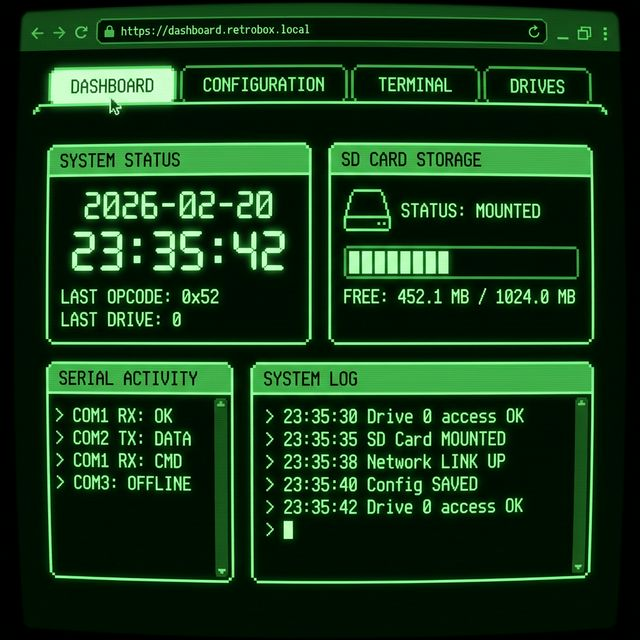
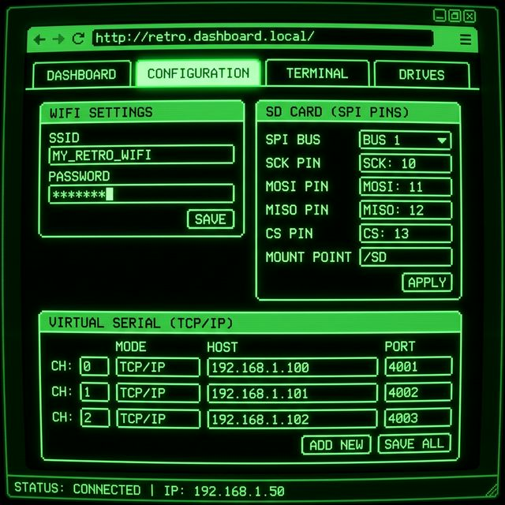
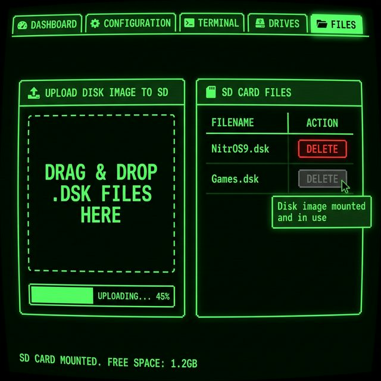
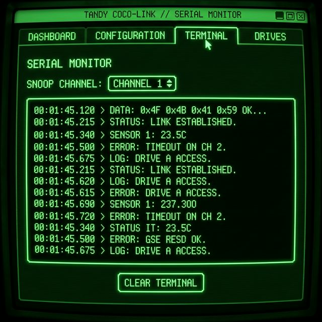
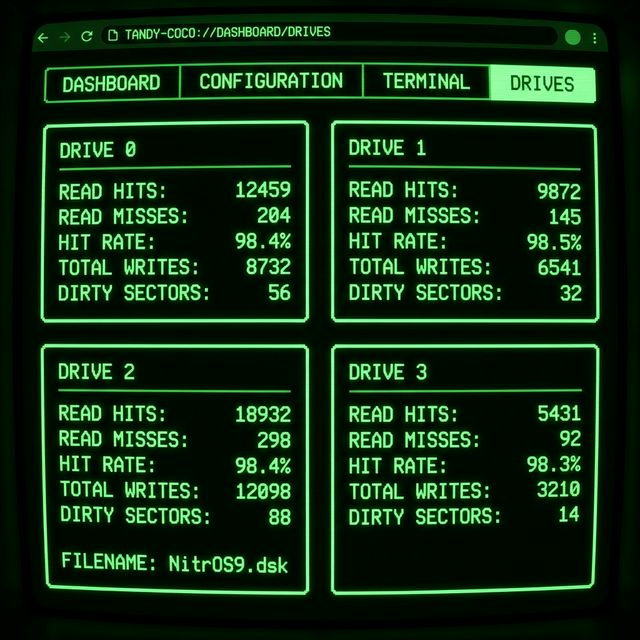

# MicroPython DriveWire Server

A full-featured DriveWire 4 server implementation in MicroPython, optimized for the **Raspberry Pi Pico W** and **Pico 2 W** with advanced memory management and performance optimizations.

## Web Interface


*Live Dashboard showing real-time DriveWire activity and system logs.*

The DriveWire server features a modern, responsive web dashboard with a retro Tandy/CoCo phosphor aesthetic. See the [Web Interface](#web-interface-dashboard) section for more details.

## Key Features

- **Flash Wear Protection**: Sector-level write-back cache buffers all disk writes in RAM and flushes to flash every 60 seconds via a background task, significantly extending flash lifespan
- **SD Card Support**: External SD card storage via SPI with automatic FAT/FAT32 mounting — disk images from internal flash and SD appear seamlessly in the same UI
- **Remote Disk Images**: Mount read-only disk images from a remote HTTP sector server over WiFi, with auto-discovery and Clone & Hot-Swap to local storage
- **Activity LED**: Onboard LED blinks during disk read/write operations and stays lit during flush — a visual indicator of DriveWire activity
- **Robust Error Handling**: Comprehensive exception handling across all I/O operations with graceful fallbacks, input validation, and resource cleanup
- **Memory Optimized**: Reduced cache sizes and const() declarations minimize RAM usage (~80-120KB typical)
- **Retro Web Dashboard**: Tandy/CoCo-inspired dark mode web interface for configuration and monitoring
- **Virtual Serial TCP/IP**: Map CoCo virtual serial ports to external network services (client and server modes)
- **Serial Terminal Tab**: Real-time diagnostic monitor for any virtual serial channel
- **Remote File Manager (RFM)**: Full DriveWire 4 RFM support for remote file operations (OPEN, READ, SEEK, CLOSE, etc.) natively from the CoCo
- **Disk Management**: Dropdown selection for `.dsk` files from local, SD, and remote sources with storage-type badges (📁 📀 🌐)
- **Automatic Library Installation**: Built-in installer fetches dependencies (`microdot`) from GitHub with retry logic
- **NTP Time Sync**: Automatic CoCo system time synchronization on boot, plus a background 12-hour periodic sync with retry support

## Hardware Requirements

- **Microcontroller**: Raspberry Pi Pico W or Pico 2 W
- **Serial Connection**: UART pins (TX: GP0, RX: GP1 by default)
- **Level Shifter**: TTL-to-RS232 level shifter **required** to safely connect to the CoCo's serial port
- **SD Card Module** *(optional)*: SPI-connected microSD card breakout board (see [Wiring Guide](docs/wiring.md))
- **Memory**: Minimum 264KB RAM (Pico W/2 W have sufficient memory)

## Performance & Memory

**Memory Usage:**
- Base system: ~60-80KB
- Per mounted drive: ~2-4KB (with 8-entry cache)
- Web server: ~20-30KB
- Total typical usage: 80-120KB

**Optimizations:**
- Reduced read cache from 16 to 8 entries per drive (saves ~2KB per drive)
- `micropython.const()` for all opcodes and constants (saves RAM)
- Limited channel buffers to 256 bytes max
- Efficient timeout handling with reset on successful reads

## Quick Start

1. **Upload Files**: Copy all files from the `micropython` folder to your Pico W/2 W root directory
2. **Configure WiFi**: Edit `config.json` on the device:
   ```json
   {
     "wifi_ssid": "YourNetworkName",
     "wifi_password": "YourPassword",
     "baud_rate": 115200
   }
   ```
3. **Power On**: Device will auto-connect to WiFi and install `microdot` if missing (requires internet)
4. **Access Dashboard**: Open browser to the IP address shown in serial terminal (use Thonny or similar)
5. **Connect CoCo**: Attach serial cable and start DriveWire on your CoCo (e.g., `DRIVEWIRE` in Disk BASIC 2.0)

## File Structure

| File | Purpose |
|------|---------|
| `main.py` | Entry point; starts the servers |
| `drivewire.py` | Core DriveWire protocol logic |
| `web_server.py` | Microdot-based web server and API |
| `config.py` | Configuration management with validation |
| `sd_card.py` | SD card SPI initialization and FAT mount |
| `activity_led.py` | Onboard LED activity indicator |
| `lib_installer.py` | Automated dependency installer |
| `time_sync.py` | NTP time synchronization |
| `syslog.py` | Syslog client for remote logging |
| `resilience.py` | Centralized logging, watchdog timer, and GC management |
| `boot.py` | Boot sequence (WiFi, SD card, libraries) |
| `fs_repair.py` | Scrubs root filesystem for conflicts on boot |
| `www/` | Static assets for the web dashboard |
| `tools/sector_server.py` | Linux-side HTTP sector server for remote disk images |

## SD Card Support

The server supports external SD card storage via SPI for additional `.dsk` disk images. Cards must be formatted as **FAT or FAT32**.

### Wiring (Default SPI Pins)

For detailed wiring instructions and visuals for specific devices like Adafruit 4682 and 6038, see the [SPI SD Wiring Guide](docs/wiring.md).

| Signal | Default Pin | Description |
|--------|-------------|-------------|
| SCK    | GP10        | SPI clock |
| MOSI   | GP11        | Master Out Slave In |
| MISO   | GP12        | Master In Slave Out |
| CS     | GP13        | Chip Select |
| VCC    | 3V3 OUT     | 3.3V power |
| GND    | GND         | Ground |

> **Tip**: An external pull-up resistor (~5kΩ) on the MISO line is recommended for stability.

### Configuration

SPI pins are configurable via the web UI or `config.json`:
```json
{
  "sd_spi_id": 1,
  "sd_sck": 10,
  "sd_mosi": 11,
  "sd_miso": 12,
  "sd_cs": 13,
  "sd_spi_baudrate": 10000000,
  "sd_mount_point": "/sd"
}
```

### How It Works

- SD card is automatically mounted at boot (after WiFi)
- `.dsk` files on both internal flash and SD card are scanned recursively (1 level deep)
- Drive dropdowns show filenames with storage-type badges: 📁 (internal) or 💾 (SD)
- Full paths are handled transparently — the user never needs to select a storage location
- The Dashboard shows SD card mount status, free/total MB, and number of `.dsk` files found
- If no SD card is inserted, the system continues normally with internal storage only

### SD Card Driver

The server uses MicroPython's standard `sdcard.py` SPI driver. If not already installed:
```python
import mip
mip.install("sdcard")
```
Or manually copy `sdcard.py` from [micropython-lib](https://github.com/micropython/micropython-lib/blob/master/micropython/drivers/storage/sdcard/sdcard.py) to your device.

## Remote Disk Images

Mount disk images hosted on a remote server (Linux, Mac, or Windows) over your local network. Remote drives are **read-only** to protect source images — use Clone & Hot-Swap to create a local read/write copy.

### When to Use

- **Development**: Compile a new `.dsk` image on your Linux build server and immediately access it from the CoCo without manual file transfer
- **Image Library**: Keep a large collection of disk images on a server and browse/mount them from the web UI
- **Testing**: Quickly iterate on OS9 or Disk BASIC builds by compiling on your workstation and mounting from the Pico

### Setting Up the Sector Server

The sector server is a zero-dependency Python script that runs on your workstation:

```bash
# Basic usage — serve all .dsk files in current directory
python tools/sector_server.py

# Specify directory and port
python tools/sector_server.py --dir /home/user/coco/disks --port 8080

# Custom server name (shown in the web UI)
python tools/sector_server.py --dir ./disks --port 8080 --name "Build Server"

# Bind to specific interface
python tools/sector_server.py --bind 192.168.1.100 --port 8080
```

The server will display a summary of available disk images on startup:
```
╔═══════════════════════════════════════════════╗
║  DriveWire Remote Sector Server v1.0          ║
╠═══════════════════════════════════════════════╣
║  Directory: /home/user/coco/disks             ║
║  Disks:     3                                 ║
║  Bind:      0.0.0.0:8080                      ║
╚═══════════════════════════════════════════════╝

  📀 NitrOS9.dsk (368,640 bytes, 1440 sectors)
  📀 toolkit.dsk (161,280 bytes, 630 sectors)
  📀 games.dsk (161,280 bytes, 630 sectors)
```

**Requirements**: Python 3.6+ (uses only standard library — no `pip install` needed).

### Sector Server API

| Endpoint | Method | Description |
|----------|--------|-------------|
| `/info` | GET | Server name, version, and list of available disks with sizes |
| `/files` | GET | List of `.dsk` filenames |
| `/sector/<filename>/<lsn>` | GET | Read a single 256-byte sector |
| `/sectors/<filename>/<lsn>?count=N` | GET | Read N consecutive sectors (bulk, max 64) |
| `/sector/<filename>/<lsn>` | PUT | Write a single 256-byte sector |

### Configuring Remote Servers in the Web UI

1. Open the DriveWire web UI in your browser
2. Go to the **CONFIGURATION** tab
3. Expand **▸ ADVANCED OPTIONS**
4. Scroll to the **REMOTE SERVERS** card
5. Click **+ ADD SERVER**
6. Enter a **Name** (e.g., `Build Server`) and the **URL** (e.g., `http://192.168.1.100:8080`)
7. Click **TEST** — a 🟢 indicator confirms the connection, 🔴 indicates a problem
8. Click **SAVE CONFIG**

Once saved, remote disk images automatically appear in:
- **Drive assignment dropdowns** with a 🌐 icon and server name: `🌐 [Build Server] NitrOS9.dsk`
- **Files tab → REMOTE FILES section** with server badge and CLONE button
- **Drives tab** with 🌐 icon and READ-ONLY badge when mounted

### Configuring via config.json

Remote servers can also be added directly to `config.json`:
```json
{
  "remote_servers": [
    {"name": "Build Server", "url": "http://192.168.1.100:8080"},
    {"name": "Image Library", "url": "http://192.168.1.200:8080"}
  ]
}
```

### Mounting a Remote Disk

1. In **CONFIGURATION → VIRTUAL DRIVES**, select a remote image from a drive dropdown (look for the 🌐 icon)
2. Click **SAVE CONFIG** — the drive is now mounted as read-only
3. The **DRIVES** tab will show the remote drive with a `READ-ONLY` badge

> **Note**: Remote drives reject all write operations. The CoCo will receive a write-protect error (E_WP) if it attempts to write to a remote drive. Use Clone & Hot-Swap to get a writable copy.

### Clone & Hot-Swap

Clone a remote disk image to local SD card storage and seamlessly switch from read-only remote to read/write local — all without rebooting the CoCo or interrupting other drives.

**From the Files tab:**
1. Go to **FILES → REMOTE FILES**
2. Click **CLONE** next to the image you want
3. In the Clone modal:
   - **LOCAL FILENAME** auto-fills from the source (editable)
   - **ASSIGN TO DRIVE** — optionally auto-mount the clone to a drive slot (hot-swap)
4. Click **CLONE** — a progress bar shows sector download progress
5. When complete, the image is on your SD card and (if a drive was selected) the drive is hot-swapped to the local copy

**From the Drives tab:**
- Remote drives show a **CLONE TO LOCAL** button directly in their stats card
- Click it to clone and hot-swap that specific drive slot

**Technical details:**
- Downloads in 4KB bulk chunks (16 sectors per request) — aligned to SD card physical sector boundaries
- Uses ~4KB of RAM during transfer regardless of image size
- A 360KB disk clones in ~5-10 seconds over WiFi
- Read cache is transferred from the old remote drive to the new local drive for seamless CoCo continuity
- The config is automatically updated to point the drive at the local file

## Activity LED

The onboard LED on the Pico W / Pico 2 W provides visual feedback during disk I/O:

- **Quick flicker**: Blinks rapidly on each sector read or write — visible activity indicator during disk access
- **Sustained glow**: Stays lit during flush operations (writing cached sectors to flash/SD)
- **Off**: No disk activity

This works identically for both internal flash and SD card images. On non-Pico hardware, LED calls are safely ignored.

## Web Interface Dashboard

Access the web UI via your Pico's IP address to monitor live activity and manage the server.

### Dashboard Performance
The dashboard utilizes a lightweight JSON API. Polling occurs every 1 second (stats/time) or 10 seconds (SD status), ensuring minimal CPU impact on the SPI/UART DriveWire timing.

| Tab | Description |
| :--- | :--- |
| **DASHBOARD** | Large live clock, opcode/drive stats, SD storage info, and system logs. |
| **CONFIG** | WiFi, NTP, SD pin configuration, virtual serial station mapping, and remote server configuration. |
| **TERMINAL** | Real-time "snoop" monitor for any virtual serial channel (0-31). |
| **FILES** | Remote file manager for SD card and remote servers. Upload images via drag-and-drop (up to 100MB), clone remote images to local storage, and delete old images. |
| **DRIVES** | Detailed I/O statistics, read hit/miss ratios, dirty sector counts, and clone-to-local buttons for remote drives. |

#### Web Interface Preview


*Live system status, server time, and SD storage monitor.*


*Hardware configuration, GPIO pin mapping, and network station settings.*


*Drag-and-drop file manager for SD card disk images.*


*Serial monitor for real-time debugging of virtual serial traffic.*


*Detailed performance metrics and cache status for all virtual drives.*

## Troubleshooting

### WiFi Connection Issues
- **Problem**: "WiFi connection failed after all retries"
- **Solution**: Verify SSID and password in `config.json`. Check that your network is 2.4GHz (Pico W doesn't support 5GHz)

### Library Installation Fails
- **Problem**: "Manual download failed" or "All download attempts failed"
- **Solution**: Manually download `microdot.py` and `microdot_asyncio.py` from [microdot v1.3.4](https://github.com/miguelgrinberg/microdot/tree/v1.3.4/src) and copy to device root

### CoCo Not Responding
- **Problem**: CoCo hangs or doesn't detect DriveWire
- **Solution**: 
  - Verify level shifter connections (TX/RX not swapped)
  - Check baud rate matches CoCo settings (default 115200)
  - Ensure UART0 (GP0/GP1) is not used by REPL
  - Try power cycling both devices

### SD Card Not Detected
- **Problem**: "SD card: Mount failed" or no SD card indicator in dashboard
- **Solution**:
  - Verify SPI pin wiring matches config (default: SCK=GP10, MOSI=GP11, MISO=GP12, CS=GP13)
  - Ensure card is formatted as FAT or FAT32 (not exFAT)
  - Check that `sdcard.py` driver is installed on the device
  - Try a different SD card — some cards have SPI compatibility issues
  - Add a ~5kΩ pull-up resistor on the MISO line

### Memory Errors
- **Problem**: "MemoryError" or system crashes
- **Solution**: 
  - Reduce number of mounted drives
  - Clear `error.log` and `boot_error.log` files
  - Run `gc.collect()` in REPL before starting
  - Check free memory with `import gc; gc.mem_free()`

### Watchdog Timer (WDT) and Thonny File Transfers

The RP2040 hardware watchdog timer **cannot be disabled once started**. If it is not fed within ~8 seconds, the Pico reboots. The server handles this automatically, but it matters when using Thonny:

- **Normal operation**: A background `asyncio` task feeds the WDT every 2 seconds.
- **After Ctrl-C**: When you press **Stop/Restart** (Ctrl-C) in Thonny, the async loop exits. The server's `KeyboardInterrupt` handler immediately starts a **hardware timer** that continues feeding the WDT every 2 seconds. You will see `WDT kept alive via hardware timer. Safe to upload files.` in the Thonny console.
- **Uploading files**: Once you see that message, it is safe to upload files via Thonny's file manager. The hardware timer keeps the WDT alive in the background — no reboot will occur during your transfer.

**Recommended Thonny workflow:**

1. Click **Stop/Restart** (Ctrl-C) — wait for the `WDT kept alive via hardware timer` message
2. Use Thonny's file manager to upload/download/delete files as needed
3. Click **Run** or press Ctrl-D (soft reboot) to restart the server

> **Caution**: If you hard-reset the device (unplug USB) while the WDT is active, that is normal — the device will reboot cleanly. The WDT is only a concern when the REPL is active and you need time to transfer files.

### Time Sync Fails
- **Problem**: "Time sync failed after all retries"
- **Solution**: Verify NTP server is reachable. Try changing `ntp_server` in config to `"time.google.com"` or `"time.nist.gov"`

### Remote Disk Connection Issues
- **Problem**: TEST button shows 🔴 or remote images don't appear in dropdowns
- **Solution**:
  - Verify the sector server is running on your workstation (`python tools/sector_server.py`)
  - Ensure the URL includes the port (e.g., `http://192.168.1.100:8080`, not just the IP)
  - Check that the Pico W and your workstation are on the same network/subnet
  - Confirm no firewall is blocking the sector server port
  - Try accessing `http://<server-ip>:8080/info` from a browser to verify the server is reachable

### Clone Fails or Stalls
- **Problem**: Clone progress stops or shows an error
- **Solution**:
  - Verify the SD card has enough free space for the image
  - Check the sector server console for error messages
  - Ensure WiFi signal is stable (weak signal causes HTTP timeouts)
  - Only one clone operation can run at a time — wait for the current one to finish

## Advanced Configuration

### Virtual Serial Mapping
Map CoCo serial channels to TCP connections in `config.json`:
```json
"serial_map": {
  "0": {"host": "towel.blinkenlights.nl", "port": 23, "mode": "client"}
}
```

### Remote Servers
Configure HTTP sector servers for remote disk images in `config.json`:
```json
"remote_servers": [
  {"name": "Build Server", "url": "http://192.168.1.100:8080"}
]
```
See [Remote Disk Images](#remote-disk-images) for full setup instructions.

### Timezone Configuration
Set timezone offset from UTC (-12 to +14):
```json
"timezone_offset": -6
```

### Custom Baud Rates
Supported rates: 9600, 19200, 38400, 57600, 115200, 230400, 460800, 921600

## API Endpoints

| Endpoint | Method | Description |
|----------|--------|-------------|
| `/api/config` | GET/POST | Read or update server configuration |
| `/api/files` | GET | List all `.dsk` files (internal + SD) |
| `/api/status` | GET | Real-time server stats, logs, drive info |
| `/api/sd/status` | GET | SD card mount status and storage info |
| `/api/serial/monitor` | POST | Set serial monitor channel |
| `/api/remote/files` | GET | List `.dsk` files from all configured remote servers |
| `/api/remote/test` | POST | Test connectivity to a remote sector server |
| `/api/remote/clone` | POST | Clone a remote disk image to local storage (with optional hot-swap) |
| `/api/remote/clone/status` | GET | Poll clone operation progress |
| `/api/files/delete` | POST | Delete a `.dsk` file (must not be mounted) |
| `/api/files/download` | GET | Download a `.dsk` file |
| `/api/files/upload` | POST | Upload a `.dsk` file via streaming POST |
| `/api/files/upload_status` | GET | Poll active upload progress (bytes written) |
| `/api/files/create` | POST | Create a new blank zero-filled `.dsk` image |
| `/api/files/info` | GET | File metadata (size, modification time) for all `.dsk` files |

## Error Handling

The server implements comprehensive exception handling throughout:
- **I/O safety**: All file, UART, and network operations use try/except with specific exception types
- **Resource cleanup**: try/finally ensures files and connections close even on errors
- **Input validation**: LSN bounds, data lengths, channel ranges, and config keys are validated
- **Graceful degradation**: Time sync, SD mount, and TCP connections fall back without crashing
- **Per-drive isolation**: A flush or close error on one drive doesn't affect others

## Contributing

This is a fork of the original [DriveWire](https://github.com/boisy/DriveWire) project. Contributions welcome!
