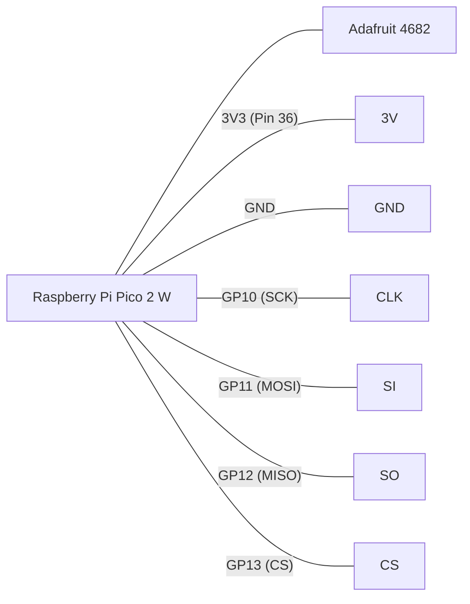
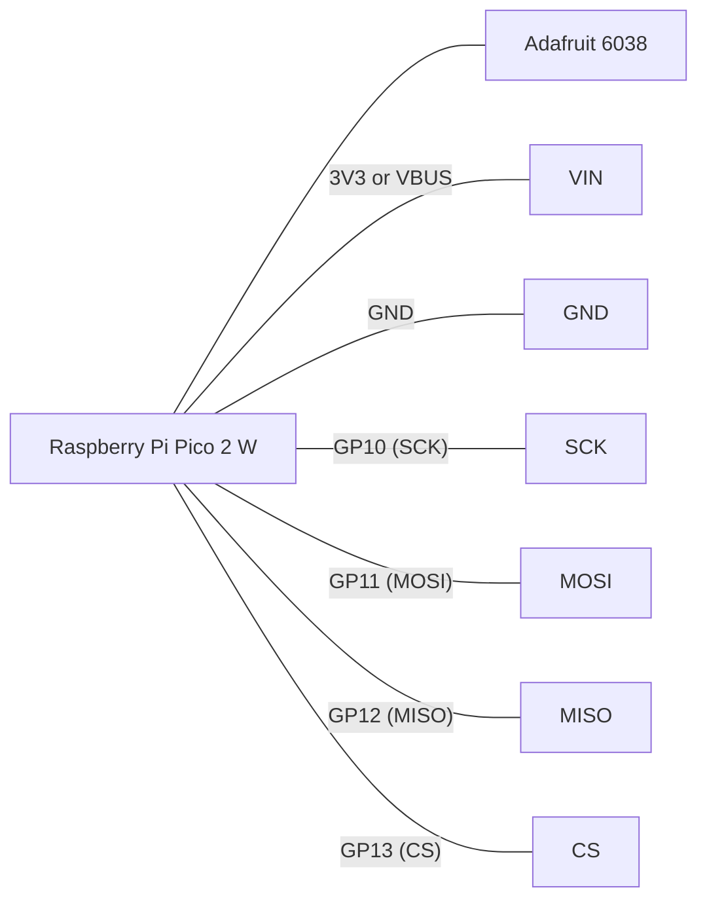

# SPI SD Storage Wiring Guide

This guide explains how to connect SPI SD storage devices to the Raspberry Pi Pico 2 W for use with the DriveWire MicroPython server.

## Default SPI Configuration

The current code is configured to use **SPI Bus 1** with the following GPIO pins:

| Signal | Pico 2 W GPIO | Pin Number |
| :--- | :--- | :--- |
| **SCK** (Clock) | GP10 | 14 |
| **MOSI** (Data In) | GP11 | 15 |
| **MISO** (Data Out) | GP12 | 16 |
| **CS** (Chip Select) | GP13 | 17 |

> [!NOTE]
> These assignments can be customized in `config.json`.

---

## Adafruit 4682 (Micro SD Breakout)

The [Adafruit 4682](https://www.adafruit.com/product/4682) is a compact Micro SD breakout. 

> [!CAUTION]
> **3.3V LOGIC ONLY!** This board does not have level shifters or a voltage regulator. Do **NOT** connect it to 5V (VBUS). Use only the 3.3V power from the Pico.

### Wiring Table

| Adafruit 4682 Pin | Pico 2 W Pin | Description |
| :--- | :--- | :--- |
| **3V** | **3V3 (Pin 36)** | Power (3.3V) |
| **GND** | **GND (Pin 3, 8, 13...)** | Ground |
| **CLK** | **GP10 (Pin 14)** | SPI Clock |
| **SI** (Serial In) | **GP11 (Pin 15)** | MOSI |
| **SO** (Serial Out) | **GP12 (Pin 16)** | MISO |
| **CS** | **GP13 (Pin 17)** | Chip Select |

### Wiring Diagram (Mermaid)

---

## Adafruit 6038 (SPI Flash SD)

The [Adafruit 6038](https://www.adafruit.com/product/6038) uses a 2GB NAND flash chip that behaves like an SD card. It includes level shifters and a regulator, making it safe for 3V or 5V systems.

### Wiring Table

| Adafruit 6038 Pin | Pico 2 W Pin | Description |
| :--- | :--- | :--- |
| **VIN** | **3V3 (Pin 36)** or **VBUS (Pin 40)** | Power (3-5V) |
| **GND** | **GND (Pin 3, 8, 13...)** | Ground |
| **SCK** | **GP10 (Pin 14)** | SPI Clock |
| **MOSI** | **GP11 (Pin 15)** | Data Input |
| **MISO** | **GP12 (Pin 16)** | Data Output |
| **CS** | **GP13 (Pin 17)** | Chip Select |

### Wiring Diagram (Mermaid)

